# Machine Learning con Watson Studio

> Presentación [Introducción a Machine Learning](https://ibm.box.com/v/intro-ml-ppt)

## Componentes Incluidos
* [Watson Studio](https://cloud.ibm.com/catalog/services/watson-studio): Watson Studio es una herramienta end-to-end que permite desarrollar modelos de machine learning y deep learning combinando los principales proyectos Open Source y herramientas propias de IBM en la nube.
* [Jupyter Notebook](http://jupyter.org/): Es una aplicación web Open Source que le permite crear y compartir documentos que contienen código en vivo, ecuaciones, visualizaciones y texto narrativo.

# Prerequisitos

* Cuenta activa de [IBM Cloud](https://cloud.ibm.com)

# Paso a Paso

### 1. Clonar el repo

Descarga o clona el repositorio `watson-studio` localmente. 
En una terminal, puedes ejecutar:

```
$ git clone https://github.com/libardolara/watson-studio
```

### 2. Crear los servicios en IBM Cloud

* Crea el servicio [Object Storage](https://cloud.ibm.com/catalog/services/cloud-object-storage)
* Crea el servicio [Watson Studio](https://cloud.ibm.com/catalog/services/watson-studio)
* Crea el servicio [Machine Learning](https://cloud.ibm.com/catalog/services/machine-learning)

### 3. Crear un Proyecto en Watson Studio

Abre tu servicio de Watson Studio ya sea en [dashboard de IBM Cloud](https://cloud.ibm.com/resources) o en el site de [Watson Studio](https://www.ibm.com/cloud/watson-studio) haciendo click en _Sign in_

* En la pagina principal de Watson Studio haz click en _New Project_ y crea un proyecto estándard con todos los recursos (Complete)
* Dale un nombre a tu proyecto
* Asegurate que en Storage este escogido el servicio de **Object Storage** que creaste en el numeral anterior. Si no esta seleccionado debes hacer click en _Add > Existing_ y selecciona de la lista desplegable el servicio.
* Haz click en _Create_

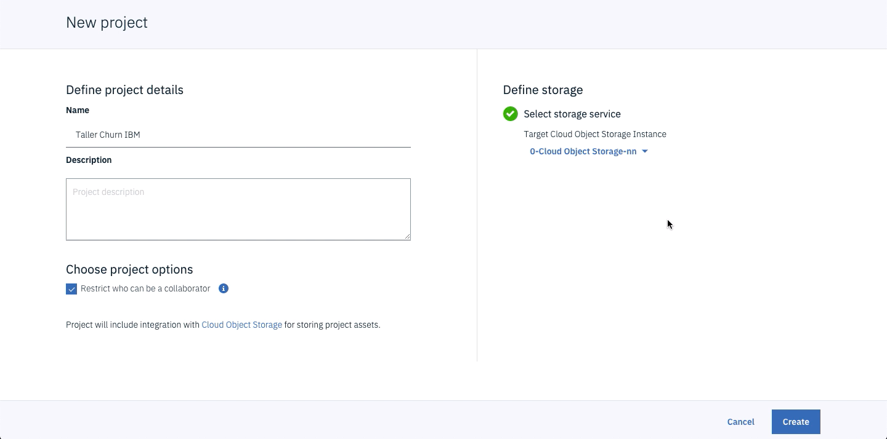

> Vamos a agregar al proyecto servicios adicionales como _Watson Machine Learning_

* Haz click en la pestaña _Settings_
* Navega hacia abajo hasta la sección _Associated Services_ 
* Haz click en _Add Service_ y selecciona _Watson_

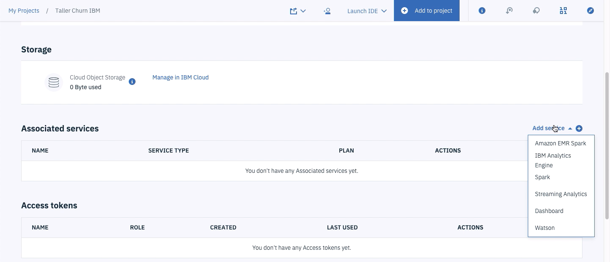

* En la lista de servicios de _Watson_ haz click _Add_ para el servicio de _Machine Learning_

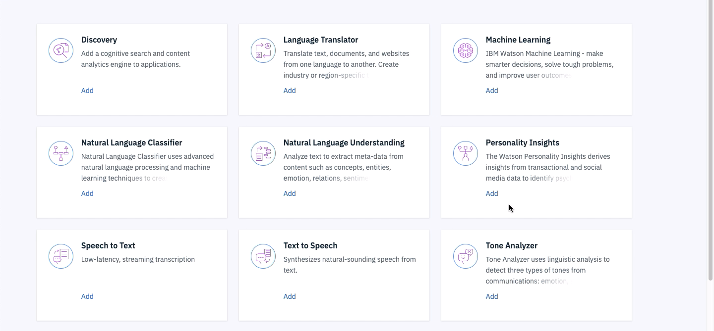

* En la pestaña _Existing_ selecciona tu servicio de **Machine Learning**

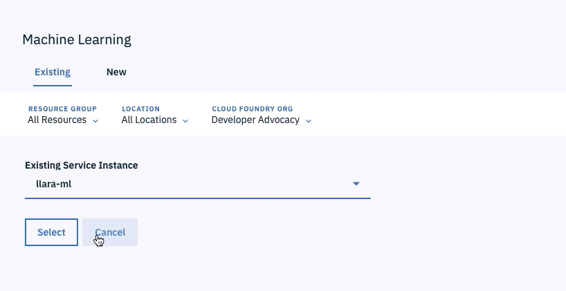

* La herramienta te redirige al proyecto en la sección _Associated Services_

### 4. Trabajar con un Data Set

* En la pestaña de _Assests_ en la sección _Load_ arrastra el archivo [Churn_ds.csv](Churn_ds.csv)

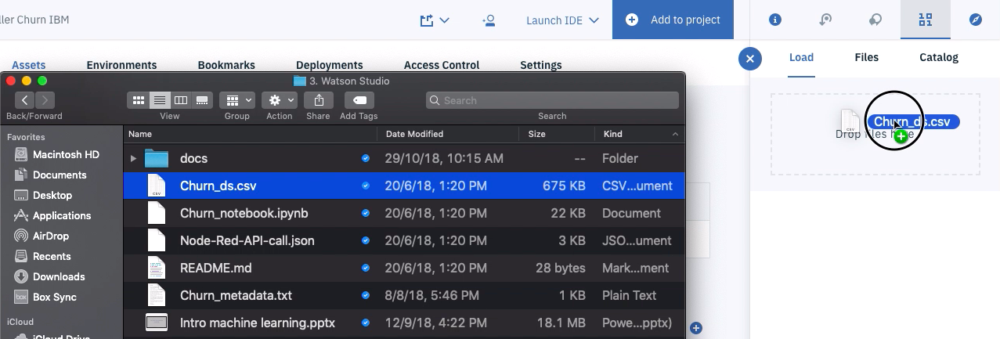

* Al cargar un archivo se crea automaticamnte un _Data Asset_. Haz click en el _Data Asset_ con el nombre **Churn_ds.csv**.
* Analiza los datos, si necesitas entender el contexto de las columnas encuentra la metadata en [Churn_metadata.txt](Churn_metadata.txt)
* Haz click en _Refine_


> En este punto vamos a usar el servicio **Data Refinery** para crear un flujo de modificación de los datos.

* Haz click en el menú de los 3 puntos para la Columna _RowNumber_ y selecciona la opción _Remove_

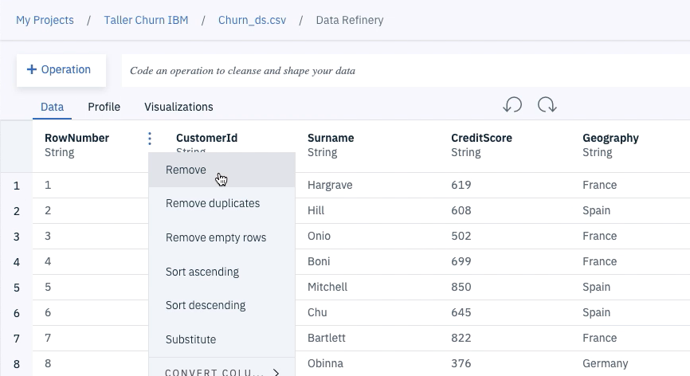

* Repite el punto anterior para las columnas _CustomerID_ y _Surname_
* En el campo Operation pega el siguiente codigo para cambiar los campos que deberian ser enteros

```
mutate_at(vars('CreditScore','Age','Tenure','NumOfProducts','HasCrCard','IsActiveMember','Exited'),funs(as.integer))
```


> **Data Refinery** permite usar codigo R para modificar las columnas del data set.

* En el campo Operation pega el siguiente codigo para cambiar los campos que deberian ser decimales

```
mutate_at(vars('Balance','EstimatedSalary'),funs(as.numeric))
```

* Ahora ve a la pestaña _Profile_ y observa la distribución de cada columna.

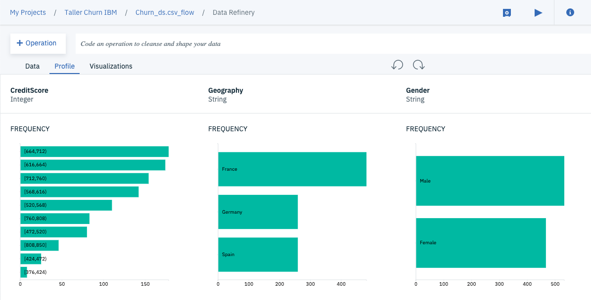

* Ahora ve a la pestaña _Visualization_ y crea un **Histograma** con variable x _CreditScore_ particionado por _Gender_
* Descarga la grafica haciendo click en el icono de descargar.

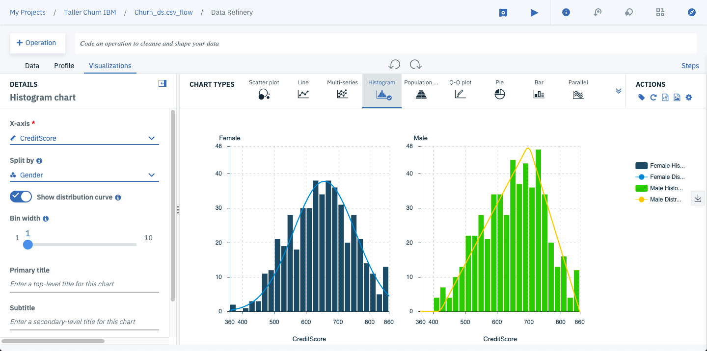

* Activa el flujo de datos haciendo click en el botón de ejecución (Un triangulo) en la el menú superior.
* Selecciona la opción **Save and create Job**
* En la configuración de la ejecución del flujo de datos, configura el ambiente de ejecución con el ambiente **Default Spark R 3.4** o superior.

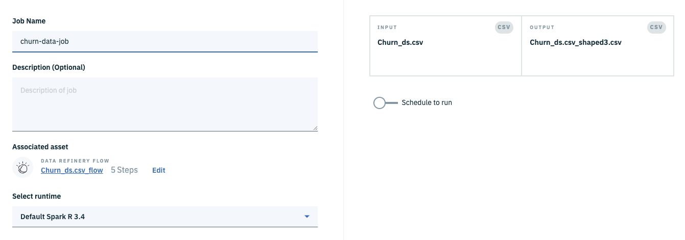

* Haz click en el botón _Create and Run_
* Espera a que el flujo termine su ejecución.
* Vuelve a tu proyecto haciendo click en el nombre del proyecto en el menú de navegación


### 5. Trabajar con AutoAI Experiment

AutoAI Experiments permite de forma automatica preparar, modelar y sintonizar los parametros para el mejor modelo de machinie learning.

* Haz click en el botón **Add to project**
* En el panel emergente selecciona la opción **AutoAI Experiment**

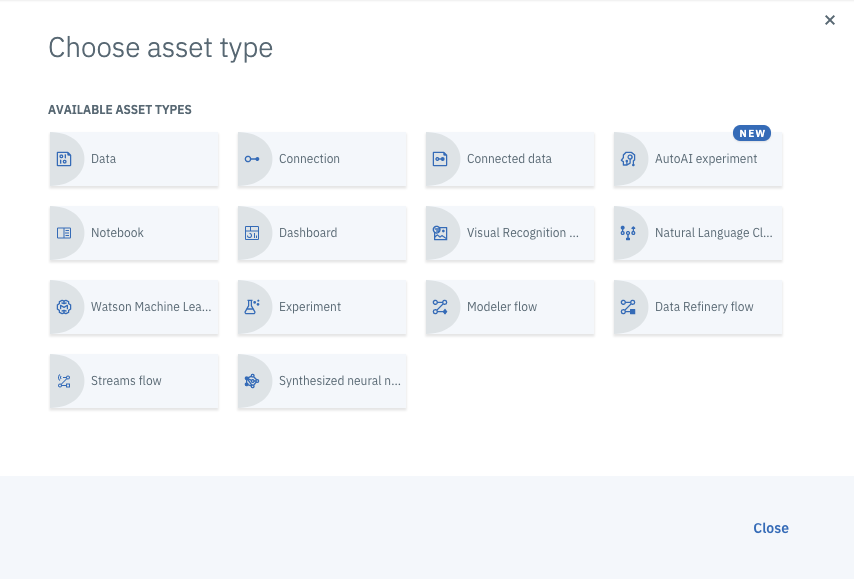

* Ingresa un nombre al Asset
* Asegurate que el servicio de _Watson Machine Learning_ este escogido. Si no esta seleccionado debes hacer click en link **Associate a Machine Learning service instance** y selecciona de la lista desplegable el servicio. Finalmente haz click en el botón **Reload**

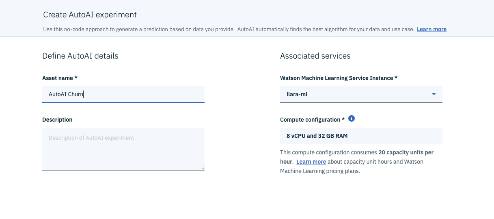

* En la pagina de configuracion del experimento, haz click en el boton **Select from project** para seleccionar el data set que creamos en el numeral anterior.
* Selecciona el data set creado en el numeral anterior.
* Selecciona la columna objetivo de nuestro modelo, es decir **Exited** que indica si una persona se quedó o se fue del banco.

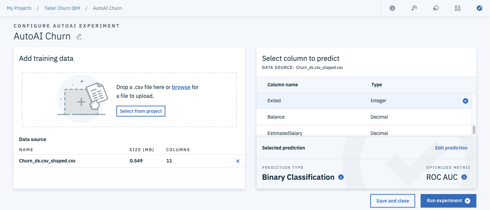

* Haz click en **Run Experiment**
* Cuando termine de ejecutarse el experimento, observa los diferentes resultados que obtuvo en la sección **Pipeline Leaderboard**


* Selecciona el flujo con el mejor resultado (ROC AUC)
* Detalla las diferentes medidas de evaluación del modelo.

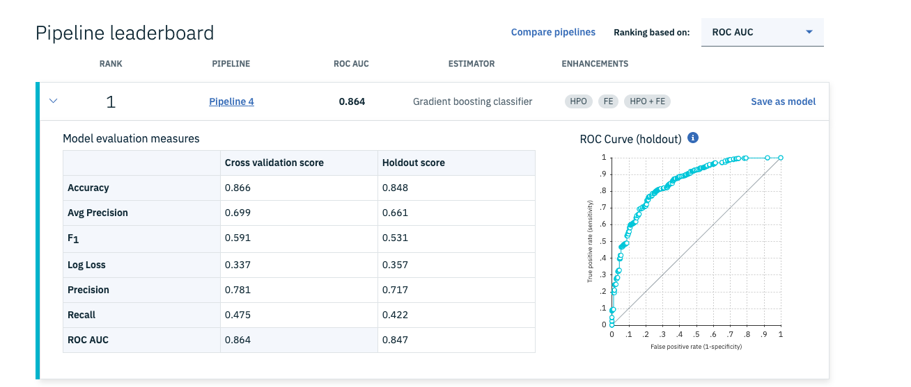

* Haz click en el botón **Save as model**
* Puedes cambiar el nombre. Haz click en el botón **Save**

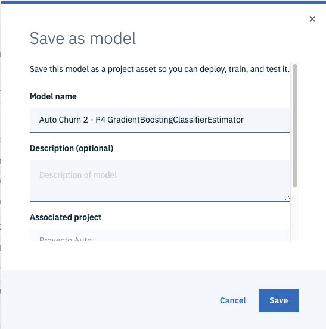

* Ve a la pagina de _Assets_ de tu proyecto, en la sección modelos **Watson Machine Learning**, encontraras el modelo que acabamos de guardar. Haz click en el modelo.
* Ve al tab _Deployments_ y haz click en _Add Deployment_
* Dale un nombre al Despliegue
* Selecciona el metodo de despliege _Web Service_
* Haz click en _Save_


* Espera hasta que el estado del despliegue diga `DEPLOY_SUCCESS` y haz click sobre el nombre del despliegue.

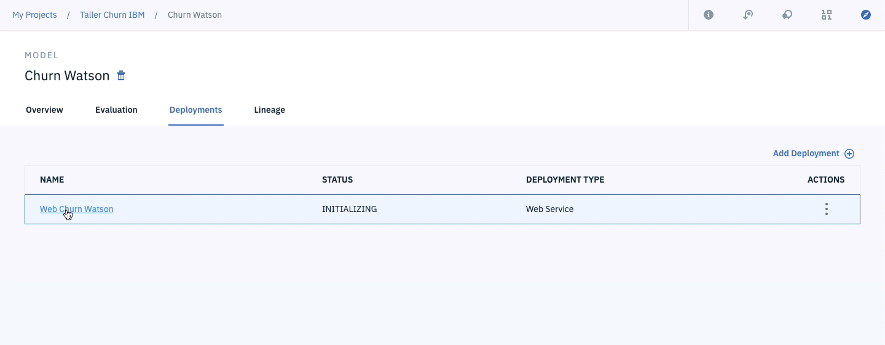

* Navega en la pestaña _Implementation_ para entender como hacer los llamados a través de REST APIs
* Navega en la pestaña _Test_ y haz un llamado al modelo.

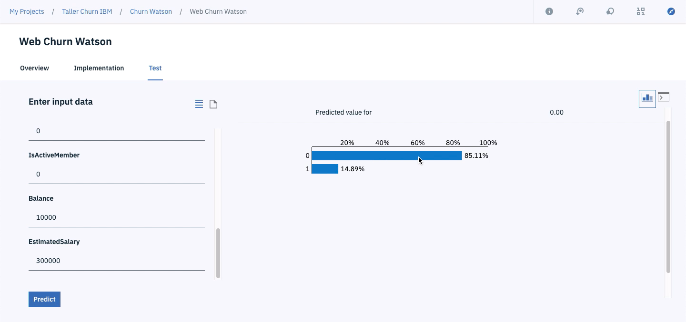


### 6. Trabajar con Notebooks

* Vuelve a tu proyecto, a la pestaña _Assets_ y navega a la sección _Notebooks_
* Haz click en _New notebook_

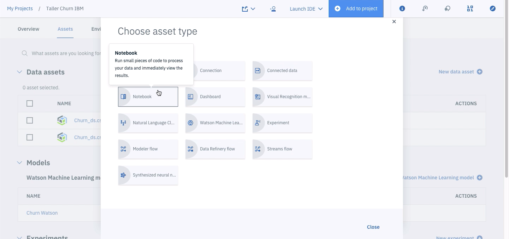

* Selecciona la pestaña _From URL_
* Dale un nombre al Notebook
* En el campo Notebook URL copia la dirección `https://github.com/libardolara/watson-studio/blob/master/Churn_notebook_py36.ipynb`
* Selecciona como _Runtime_ el servicio ambiente por defecto con pytho 3.6: _Default Python 3.6 XS_
* Haz click en _Create Notebook_

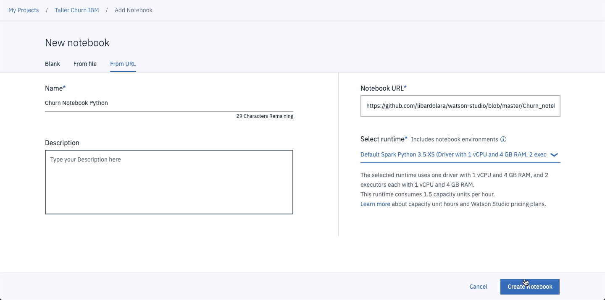

* Asegurate que el Kernel diga Python 3.6.
* Sigue las instrucciones que estan en el Notebook.

### 7. Usar el modelo desde Node-RED

* En el catalogo de IBM Cloud, crea el servicio de [Node-RED](https://cloud.ibm.com/catalog/starters/node-red-starter)
* Dale un nombre único a la aplicación, este nombre será usado para crear un subdominio web.
* Haz click en _Crear_
* Espera a que la aplicación inicialice
*	De la pestaña “input” arrastre el bloque “inject”
*	De doble click sobr este bloque y en la celda de “Payload” seleccione “JSON”
* Bajo la pestaña “Function” arrastre el bloque “function” y conéctelo después del bloque “inject”
* De doble click sobre este bloque que acaba de agregar y en la celda “Name” coloque “Token Header”. Luego en la casilla “Function” copie el siguiente código y péguelo reemplazando todo el campo:

```javascript
msg.fields=msg.payload;
msg.headers={"Content-type":"application/x-www-form-urlencoded",
"Accept":"application/json"};

//TODO Agregar el apikey de las credeciales de Watson Machine Learning
apikey = "";

msg.payload = "apikey=" + apikey + "&grant_type=urn:ibm:params:oauth:grant-type:apikey";
return msg;
```
* No te olvides de copiar tu **apikey** en el codigó anterior, recuerda que esta información esta en las credenciales de tu servicio **Watson Machine Learning**

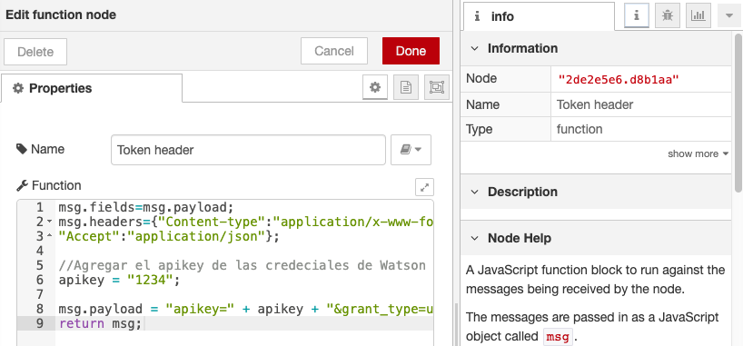

*	En la pestaña “Function” arrastre el bloque “http request” y conéctelo después del bloque del punto anterior.
* De doble click sobre el bloque de “http request” y realice la siguiente configuración en las siguientes celdas:

“Method” -> POST
“URL” -> https://iam.bluemix.net/identity/token
“Name” -> Token request

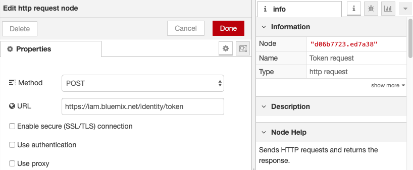

> Si deseas mayor información en la forma de autenticacion para el servicio **Watson Machine Learning**, revisa la [Documentación](https://dataplatform.cloud.ibm.com/docs/content/wsj/analyze-data/ml-authentication.html)

*	Bajo la pestaña “Function” agregue el bloque llamado “function”. Arrástrelo y conéctelo después del bloque del punto anterior.
* De doble click sobre este bloque que acaba de arrastrar y en la celda “Name” escriba `Grab Token`. Luego en la celda “Function” agregue la siguiente línea de código en la primera línea:

```javascript
msg.token = JSON.parse(msg.payload).access_token;
return msg;
```

*	Arrastre otro bloque de “function” bajo la pestaña “Function” y conéctelo con el bloque anterior.
* De doble click sobre el bloque que acabas de arrastrar y nómbrelo “Scoring Header”. Luego, en la celda “Function” copie el siguiente código y péguelo en la primera línea:

```javascript
//TODO Agregar el instance id de las credenciales de Watson Machine Learning
instance_id = "" ;

msg.headers={"Content-type": "application/json",
"Authorization":"Bearer " + msg.token,
"ML-Instance-ID": instance_id
};
msg.payload=msg.fields;
return msg;
```

* No te olvides de copiar tu **instance_id** en el codigó anterior, recuerda que esta información esta en las credenciales de tu servicio **Watson Machine Learning**
*	Arrastre otro bloque “http request” de la pestaña “Functions” y conéctelo al bloque del punto anterior.

De doble click a este bloque recién agregado y en la celda “Name” escriba “Scoring request”, en “Method” seleccione “POST” y en la celda de “URL” pegue la URL de su modelo que se puede obtener entrando a **Watson Studio** -> Entra a su proyecto -> Models -> Click sobre su modelo -> Click a pestaña “Deployments” -> Entre al deployment -> Click a la pestaña “Implementation”. En esta parte deberá ver de primero “Scoring End-point”. 

Esta es la URL del modelo que pegaremos en la celda de “URL” de este bloque de “Http Request”

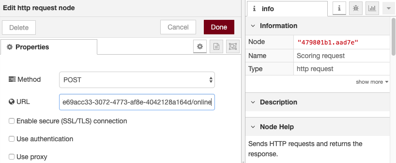

*	Para terminar el flujo de bloques ir a la pestaña “Outputs” y arrastre el bloque “debug” y conéctelo después del bloque del punto anterior. De doble click al bloque de debug  y cambie el nombre a “Prediction”.
* Para usar el flujo de doble click a al bloque de inject y en la celda de “Payload” pegue lo siguiente:

```json
{"fields":["CreditScore","Geography","Gender","Age","Tenure","Balance","NumOfProducts","HasCrCard","IsActiveMember","EstimatedSalary"],"values":[[500,"Spain","Male",50,2,10000,2,1,0,40000]]}
```

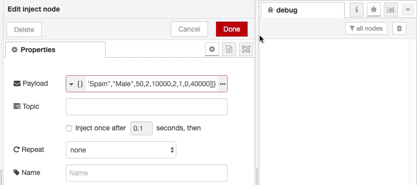

* Luego despliegue dando click en el botón “Deploy” que se encuentra en la equina superior derecho de la página
* Una vez desplegado vaya al bloque “inject” y presione el botón.
* En el panel de la derecha en la pestaña “Debug” deberá ver la respuesta del modelo.

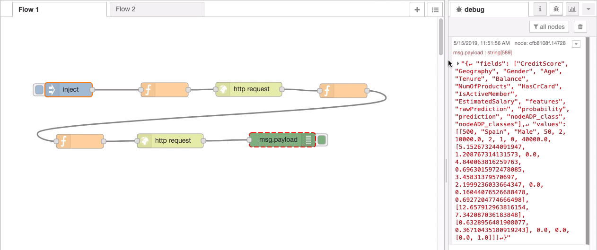
